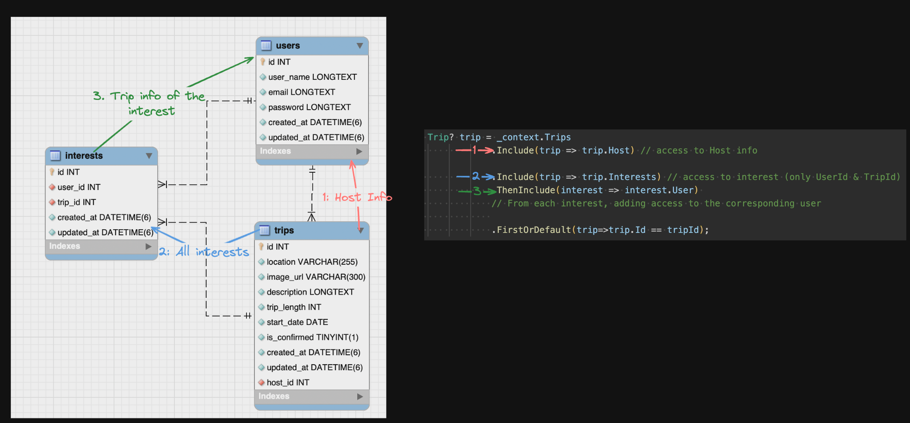

# Notes on OneToMany

## 1. Project setup
### Suggestions: Do not start until you got the 1:n working

- Create a middle table with 2 Foreign keys (UserId & TripId)
  ``` public int UserID {get; set;} ```
- Make sure each foreign key has the corresponding Nav property 
  ``` public User? User {get; set;} ```
- Make sure the 1:n table (User / Trip) include the Inverse Navigation property
  ``` public List<UserTripInterest> Interests {get;} = new(); ```

## 2. Example query
- When writing queries, take a look at the ERD to decide what to include
- Can always dig deeper by using .ThenInclude()
```cs
    Trip? trip = _context.Trips
                .Include(trip => trip.Host) // access to Host info

                .Include(trip => trip.Interests) // access to interest (only UserId & TripId)
                .ThenInclude(interest => interest.User) 
                // From each interest, adding access to the corresponding user

                .FirstOrDefault(trip=>trip.Id == tripId);
```


### HINT on queries
  ```.Any(item => item.price > 10 )``` 
  - to find if any item in the list fits the criteria 
  - Could be very helpful in checking if the user liked the item
  ``` .Sum(item => item.price) ```
  - To get the sum of all the item price
